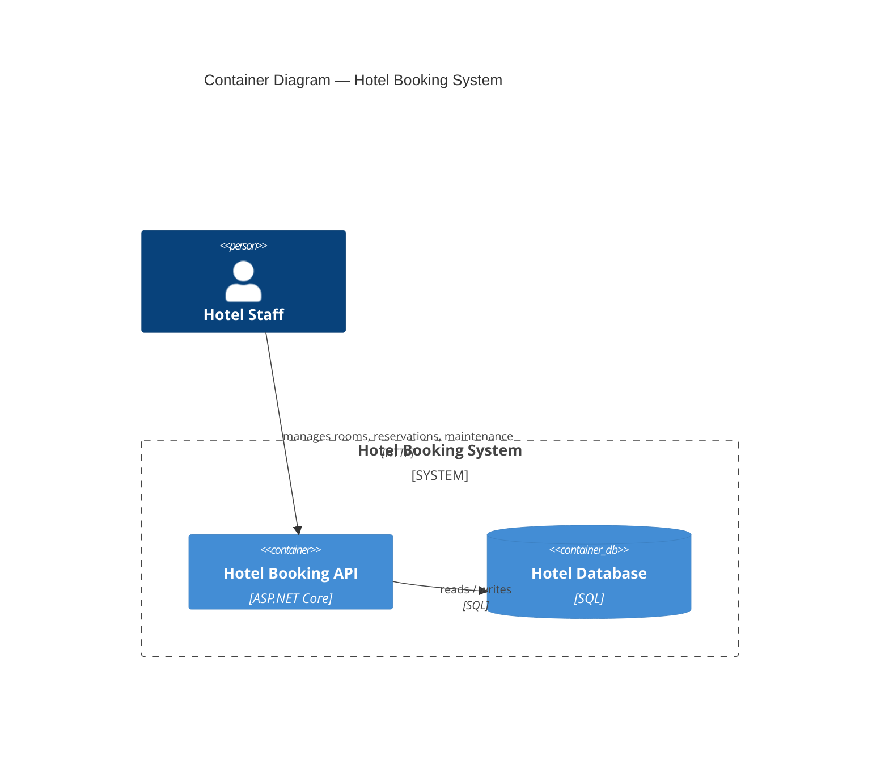
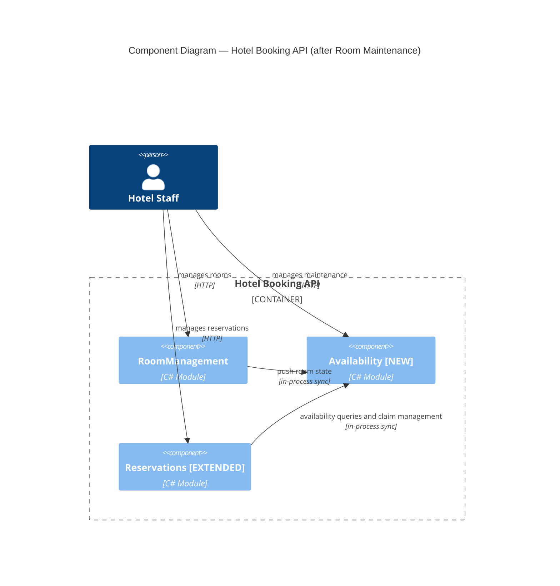

# C4 Diagrams — Room Maintenance Feature

---

## C2 — Container View

The hotel booking system is a modular monolith. All modules are deployed as a single process. The internal module structure is not visible at this level.

---

## C3 — Component View (after Room Maintenance feature)

This feature introduces the `Availability` module and changes the dependency graph between modules.

Each module owns a private schema — not shown at this level.

---

## Component Descriptions

| Component | Role in this feature |
|---|---|
| RoomManagement | Unchanged domain. Gains write-time push to Availability on room create and deactivate. |
| Availability [NEW] | New module. Owns RoomMaintenance aggregate, local room projection, and reservation claims (Slice 2). Single authority for "is this room available for this period?" |
| Reservations [EXTENDED] | Existing module. Reservation creation and period change now call Availability for claim registration. Direct RoomManagement dependency for reservation path eliminated. |

---

## Dependency Changes from Pre-Feature State

| Change | Direction |
|---|---|
| RoomManagement → Availability (push-based, write-time) | New |
| Reservations → Availability (synchronous) | New |
| Reservations → RoomManagement (for reservation availability path) | Eliminated |

---

## Future Topology Note

The `Availability` module is designed to extract to a separate deployable process without interface changes: separate schema, primitive types in the public interface, idempotent write operations. When extracted, `RoomManagement → Availability` becomes a synchronous HTTP push call and `Reservations → Availability` becomes an HTTP request. The claim registration + reservation write pattern switches from a single DB transaction to a Try-Reserve-Confirm or outbox-based pattern at that point.
