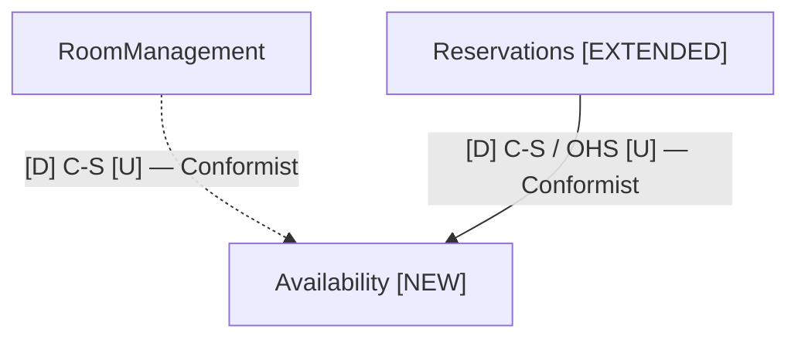
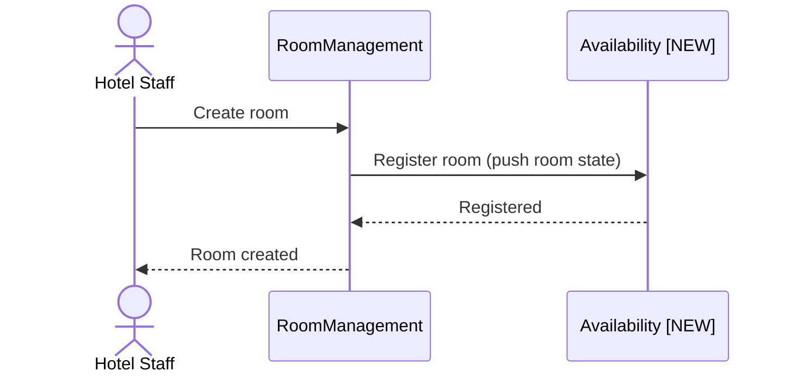
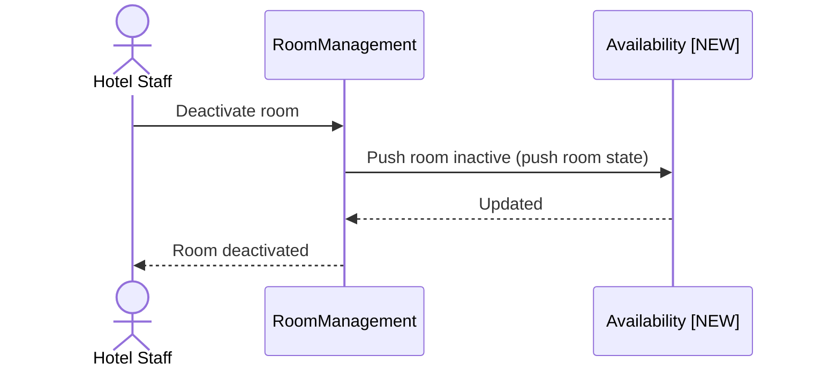
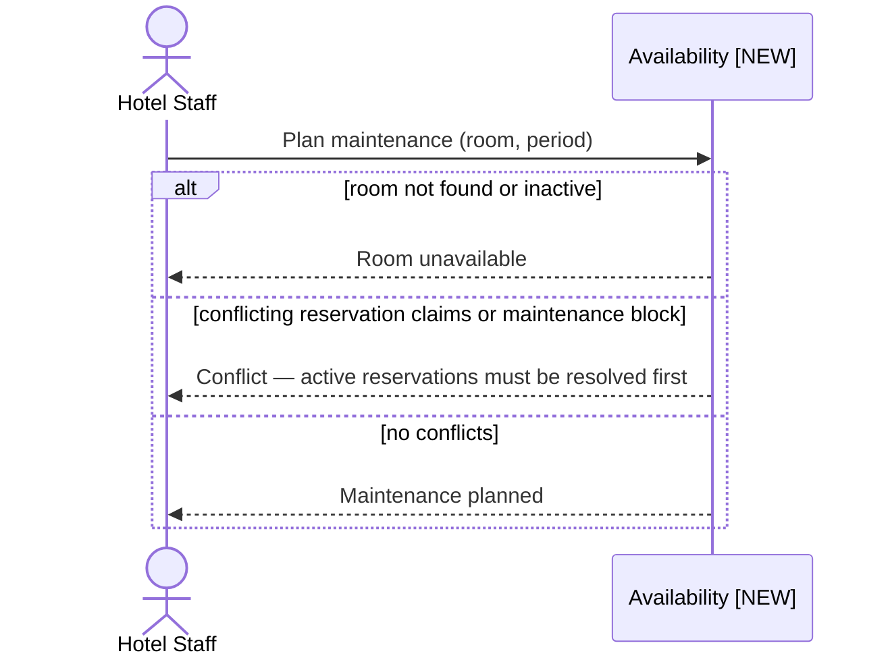
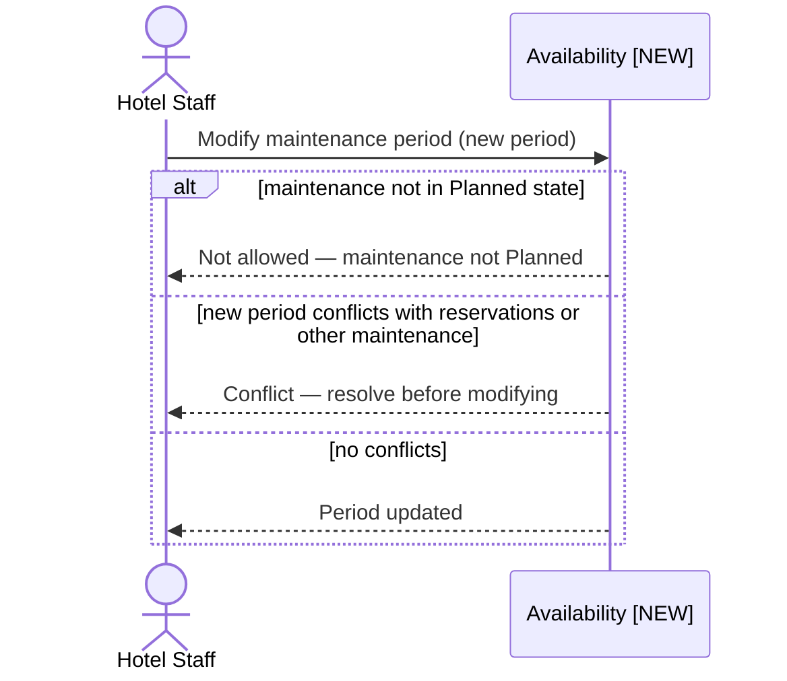
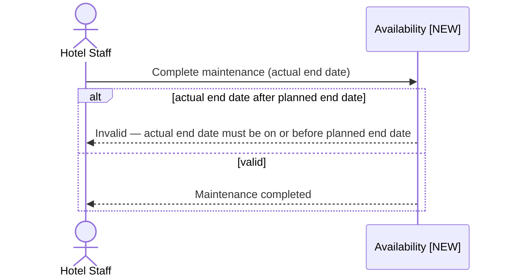
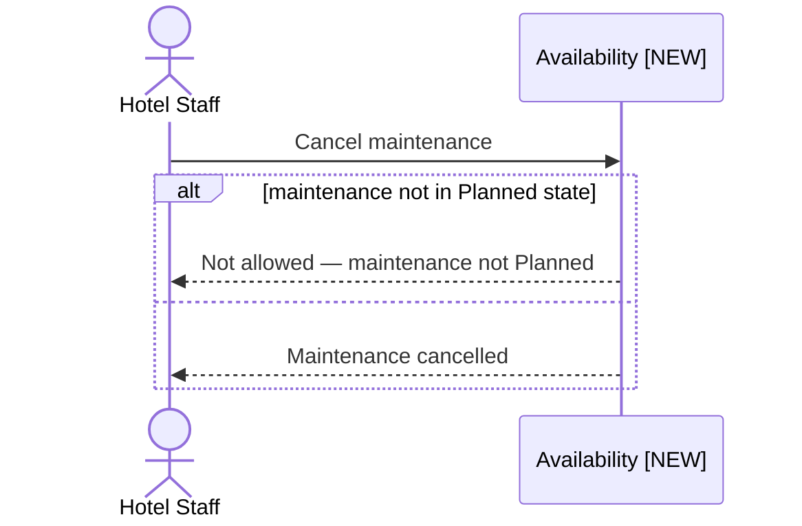
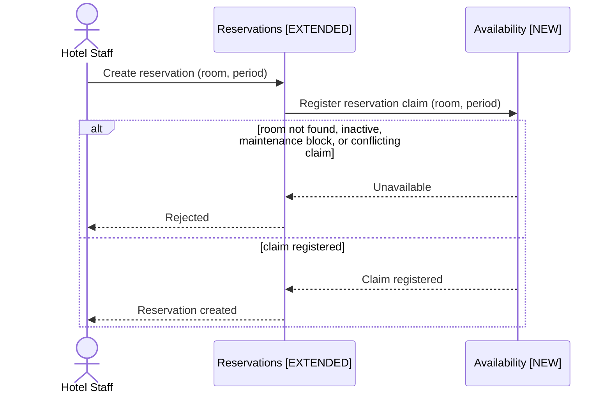
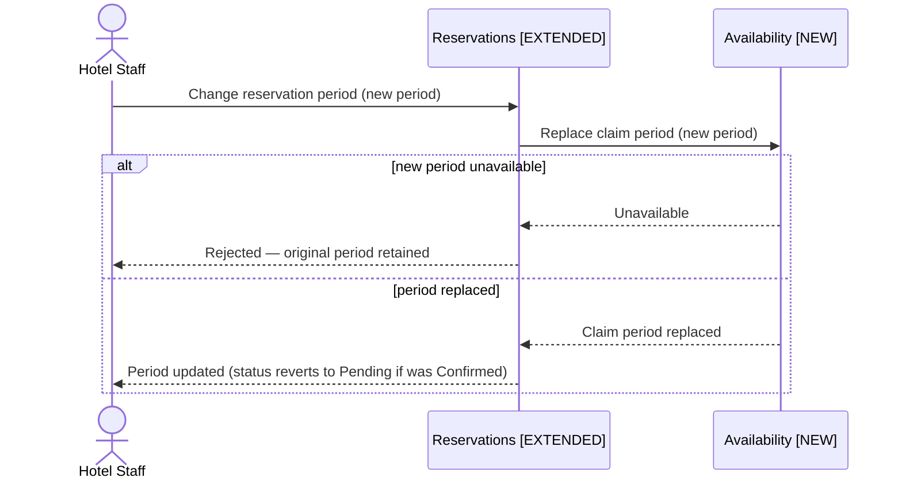
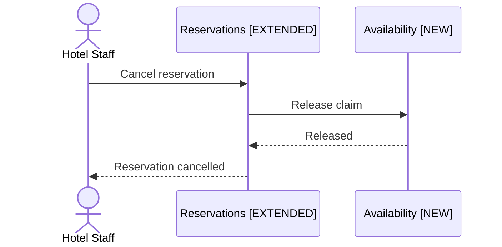

# Hotel Booking — Module Map & Integration Flows

First context map for this system. Shows all modules and their relationships after the Room Maintenance feature is delivered (Slice 2 target state).

---

## Legend

| Abbreviation | Meaning |
|---|---|
| U | Upstream — defines and owns the contract |
| D | Downstream — depends on and conforms to the upstream contract |
| C-S | Customer-Supplier — upstream controls the contract, downstream adapts |
| OHS | Open Host Service — stable protocol designed for multiple consumers |
| Conformist | Downstream uses the upstream model as-is, no translation |

---

## Module Map

Solid arrow — synchronous request/response.
Dashed arrow — push-based state synchronization (write-time only, no query-time call).

---

## Module Responsibilities

| Module | Responsibility |
|---|---|
| RoomManagement | Owns room descriptive data (name, capacity) and operational status (Active, Inactive) |
| Availability [NEW] | Single authority for room availability; owns maintenance blocks, reservation claims, and local room status projection |
| Reservations [EXTENDED] | Owns reservation intent and lifecycle (Pending, Confirmed, Cancelled) |

---

## Integration Notes

| Relationship | Strategic Pattern | Downstream | Tactical Pattern | Interface |
|---|---|---|---|---|
| RoomManagement → Availability | Customer-Supplier (RoomManagement: U, Availability: D) | Conformist | Push-Based State Sync | `IAvailabilityService` (RegisterRoom, SetRoomInactive) |
| Reservations → Availability | Customer-Supplier / OHS (Availability: U, Reservations: D) | Conformist | Synchronous request/response | `IAvailabilityService` (IsAvailableForPeriod, RegisterClaim, ReleaseClaim, ReplaceClaimPeriod) |

**OHS selection rationale (Reservations → Availability):** Availability has a high autonomy requirement (single authority, extraction-ready), and the hotel domain has confirmed future consumers beyond Reservations (owner-use blocks, short-term rental). The interface is designed with primitive types and idempotent operations to survive service extraction without interface changes.

**Removed relationship:** Reservations → RoomManagement dependency for availability and existence checks is eliminated. Availability's local room projection answers these queries.

---

## Integration Flows

### Room Management

#### Room Created (push to Availability)

Note: RoomManagement pushes at write time. Availability stores the room in its local projection. No query-time dependency from Availability to RoomManagement.

#### Room Deactivated (push to Availability)

Note: From this point, Availability.IsAvailableForPeriod returns "room inactive" for any period query on this room.

---

### Maintenance Management

#### Create Maintenance Period

Note: In the Slice 2 target state, Availability checks its own claim store for conflicting reservation claims. No call to Reservations is needed. During Slice 1, the application layer temporarily queries Reservations directly for this check — eliminated in Slice 2.

#### Modify Maintenance Period

#### Complete Maintenance (Early End Date)

Note: Room becomes available from actual end date + 1 day onward. If actual end date equals planned end date, the full maintenance window is consumed. If earlier, the remaining planned window is unblocked.

#### Cancel Maintenance

---

### Reservations

#### Create Reservation

Note: Claim registration and reservation persistence occur within the same database transaction. If persistence fails after claim registration, the transaction rolls back and the claim is not persisted.

#### Change Reservation Period

Note: ReplaceClaimPeriod is atomic — Availability releases the old period claim and registers the new period claim in a single operation. If the new period is unavailable, the old claim is preserved.

#### Cancel Reservation

Note: Claim release and reservation status update occur within the same database transaction.
