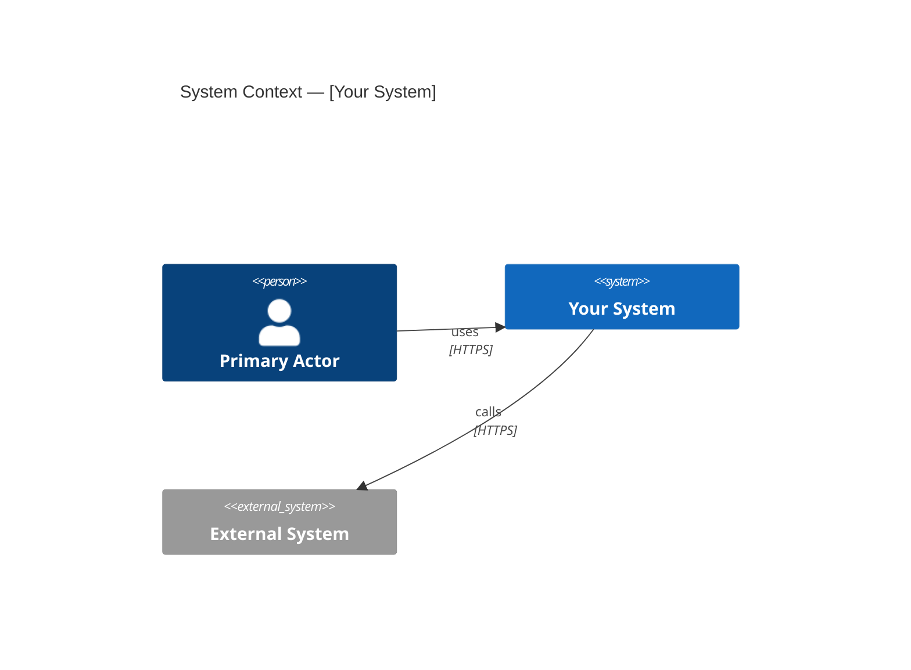
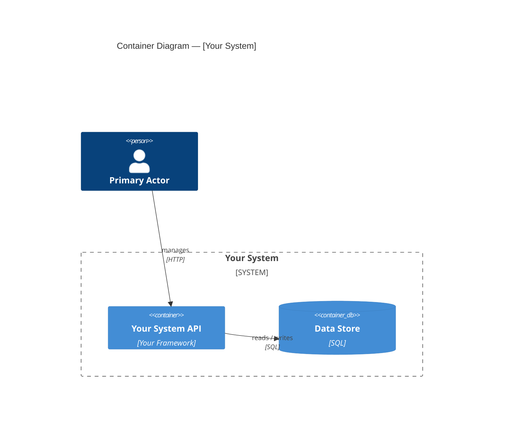
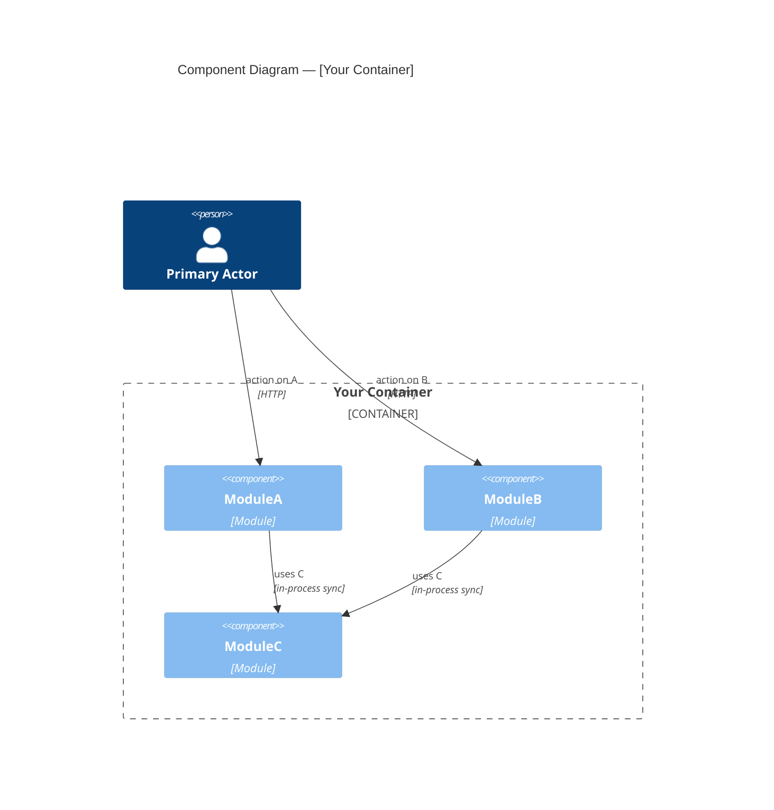

<!-- Archetype: RULES -->

# C4 Diagrams

## Scope

Apply this file when generating `c4.md` as part of the spec writer flow. This file defines which Mermaid diagram type to use at each C4 level, what each level must and must not show, and required structural elements.

**This file answers:** how to produce a syntactically correct and architecturally meaningful C4 diagram in Mermaid.

---

## Level Selection

C4 has four levels. Use the correct level for the context. Do not mix levels in one diagram.

| Level | Name | Mermaid Type | Shows |
|---|---|---|---|
| C1 | Context | `C4Context` | The system and its external actors/systems |
| C2 | Container | `C4Container` | Independently deployable units inside the system |
| C3 | Component | `C4Component` | Modules or components inside one container |
| C4 | Code | — | Classes, interfaces, methods — do not generate |

**C2 is the minimum level for every `c4.md`.** Always generate a C2 diagram when an architectural concern is confirmed.

**Generate C3 only when** the change reorganizes the internal module structure of a specific container (new module, changed public contracts between modules).

**Generate C1 only when** external actor relationships or external system integrations change.

**Never generate code-level (C4) diagrams.** Aggregates, classes, use cases, and repository interfaces belong in `implementation-plan.md` if needed, not in architectural diagrams.

---

## Code to C4 Mapping

Use this table before drawing any diagram. Misclassifying a code artifact as the wrong C4 level is the most common source of incorrect diagrams.

### C2 — what maps here

A C2 container is **any independently deployable unit** — a process boundary.

| Code artifact | C2 element? | Notes |
|:---|:---|:---|
| Entire modular monolith | Yes — ONE container | All modules live inside it; modules do not get separate C2 boxes |
| Microservice / separate process | Yes — one container per service | Each independently deployable process is one C2 container |
| Database / data store | Yes — `ContainerDb` | One per system boundary that owns it |
| Message broker (Kafka, RabbitMQ) | Yes — `Container` | When it is a first-class deployable infrastructure component |
| Solution file (`.sln`) | No | Organizational, not deployable |
| Library project inside a monolith | No | Part of the container, not its own container |
| Executable project in a microservice | Yes | It IS the deployable unit |
| Bounded context as a module in a monolith | No — belongs at C3 | The whole monolith is the container; the BC is a component inside it |
| Bounded context extracted to its own service | Yes | It has become its own deployable process |

### C3 — what maps here

A C3 component is **any logical module or bounded context inside a container** — a named, cohesive group of behavior with a public contract.

| Code artifact | C3 element? | Notes |
|:---|:---|:---|
| DDD module (e.g., `Modules/Reservations/`) | Yes | One component per module |
| Bounded context inside a monolith | Yes | The BC is the component |
| Application layer (all handlers) | No | Too fine-grained; belongs inside the component box |
| Project file inside a monolith | No | It may map to a module, but the project file is not the component |
| Aggregate | No — never shown | C4 level; never generated |
| Domain service | No — never shown | C4 level |
| Application service / command handler | No — never shown | C4 level |
| Repository interface | No — never shown | C4 level |
| Domain event | No — never shown | Events are relationships between aggregates, not boxes |

### Never generate (C4 code level)

These concepts exist in the codebase but must never appear in generated diagrams. If needed for documentation, they belong in `implementation-plan.md`.

Aggregates, entities, value objects, domain services, application services, command/query handlers, repository interfaces and implementations, domain events, integration events, infrastructure adapters, DTOs.

### DDD to C4 summary

| DDD concept | C4 level |
|:---|:---|
| System / product | C1 `System` |
| External system / third-party API | C1 `System_Ext` |
| Actor / user role | `Person` (any level) |
| Microservice | C2 `Container` |
| Modular monolith (entire) | C2 `Container` — one box |
| Bounded context (in monolith) | C3 `Component` |
| Module (in monolith) | C3 `Component` |
| Aggregate | Never shown |
| Domain service | Never shown |
| Application service | Never shown |
| Repository | Never shown |
| Domain event | Never shown |

---

## Delta scope

When generating `c4.md` for a feature that extends an existing system with a prior `c4.md` artifact:

- Show only components and relationships that are new or changed in this feature
- Mark changed components with `[NEW]` or `[EXTENDED]` in the label
- Reference the prior artifact for unchanged components: *"Unchanged modules — see prior `c4.md`"*

Simplify by reducing content, not by changing the diagram type. A C4 diagram with fewer boxes is still a C4 diagram; a `flowchart LR` is not.

---

## What Each Level Must and Must Not Show

### C2 — Container Diagram

**Must show:**
- Every independently deployable unit: API servers, databases, message queues, background services, mobile apps, external SaaS
- Relationships between containers — arrows with label and protocol
- At least one `Person` element representing the external actor(s)
- `System_Boundary` wrapping the system's own containers

**Must NOT show:**
- Internal modules, components, or bounded contexts — those belong at C3
- Aggregates, domain services, use cases, or repositories
- Method signatures or interface definitions

**For a modular monolith:** the entire application is **one container** at C2. The internal module structure is not visible at this level.

Correct C2 for a modular monolith:
```
[Actor] → [Your System API] → [Database]
```

Do not show internal modules as separate C2 containers — they are components (C3).
In a modular monolith, all modules live inside one deployable container. Only that container appears at C2.

---

### C3 — Component Diagram

**Must show:**
- `Container_Boundary` wrapping all components — the reader must know which container these components live inside
- One box per module or component
- Arrows between components labelled with the interface or contract name (not method signatures)
- At least one `Person` or external `System_Ext` on the boundary of the diagram to show context

**Must NOT show:**
- Aggregates inside component boxes
- Use case classes or application service classes
- Repository interfaces or their method signatures (`Add`, `Update`, `GetById`, etc.)
- Implementation classes or infrastructure details

**The boundary between C3 and C4:**
- C3 shows: `ModuleA` → `IModuleBService` → `ModuleB`
- C4 shows: `ModuleACommandHandler` calls `IModuleBService.DoOperation()`, implemented by `ModuleBService`, which calls `IModuleBRepository.Add()`

C3 never reaches inside the boxes. It shows only the public surfaces between boxes.

---

## Data store rules

**C2 level:** one `ContainerDb` per system boundary is sufficient. Keep description `""`.

**C3 level:** omit `ContainerDb`. Each module owns a private schema — persistence is not a shared cross-module dependency. Add one prose note below the diagram: *"Each module owns a private schema — not shown at this level."*

**Exception:** when two system boundaries each own separate databases (e.g., after module extraction to a separate service), show one `ContainerDb` per boundary at C2. That is architecturally significant.

**Layout:** Mermaid C4 has no explicit layout directives. To get modules above and database below within the same boundary, declare `Container` elements before `ContainerDb` — Mermaid's auto-layout follows declaration order within a boundary block.

---

## Required Structural Elements

Every C4 diagram must have:

1. **A descriptive title** — use the `title` keyword inside the diagram block
2. **At least one `Person`** — the external actor who interacts with the system boundary
3. **For C2:** `System_Boundary` wrapping the system's own containers
4. **For C3:** `Container_Boundary` wrapping all components, identifying the parent container

A diagram missing any of these is structurally incomplete.

---

## Tile content rules

**Tile fields:**

| Field | Rule | Example |
|---|---|---|
| Label | Module or container name + `[NEW]` / `[EXTENDED]` tag when relevant | `Availability [NEW]` |
| Technology | 1-2 words maximum | `ASP.NET Core`, `C# Module`, `SQL` |
| Description | Empty string `""` — details go in prose below the diagram | `""` |

A tile must not contain responsibility sentences, contents lists, multi-framework technology strings, or anything that makes the tile taller than 3 lines.

**Relationship labels:** business action or event name only, 2-4 words. No method signatures, no parameter lists, no library class names.

---

## Relationship Technology Field

The technology field on a `Rel(...)` is the **transport or communication mechanism** — not an interface name, event name, or method name.

| Scenario | Correct technology field | Wrong |
|---|---|---|
| In-process synchronous call | `"in-process sync"` | `"IAvailabilityService"` |
| In-process async event | `"in-process async"` | `"AccountCreated"` |
| HTTP REST between services | `"HTTP"` | `"IAvailabilityService"` |
| Message broker between services | `"message broker async"` | `"AccountCreated event"` |
| Database read/write | `"SQL"` | `""` (empty is wrong) |

Event names, interface names, and method names belong in the **relationship label** (first string argument), not in the technology field.

For async relationships, make communication type visible in the technology field. Use `"in-process async"` for in-process event dispatch. Use `"message broker async"` for broker-based delivery. Name the library only in prose below the diagram if needed, not in the diagram tile. This distinction is architecturally significant in DDD — it signals eventual consistency boundaries.

**C4 notation is not optional:** use `C4Container` for C2, `C4Component` for C3. Do not substitute with `flowchart` or `graph LR` to "simplify." Simplify by reducing content, not by changing the diagram type.

---

## Mermaid Syntax Reference

Use only the dedicated C4 Mermaid types. Do not use `graph TD`, `graph LR`, or `flowchart` for C4 diagrams.

### C4Context (C1)



### C4Container (C2)



### C4Component (C3)



Each module owns a private schema — not shown at this level.

---

## Multiple Diagrams in One File

When `c4.md` contains multiple diagrams:
- Each diagram has a clear heading that states both the level and the scenario — for example `## C2 — Container View (current: modular monolith)` or `## C2 — Container View (after Availability extraction)`
- Each diagram is a separate fenced code block with its own Mermaid type declaration
- Do not place two levels in one `mermaid` block
- Different deployment topologies (current vs future) are separate C2 diagrams, not one diagram with extra elements

---

## Validation Checklist

Before finalizing `c4.md`, verify:

- [ ] Each diagram uses `C4Context`, `C4Container`, or `C4Component` — not `graph TD` or `graph LR`
- [ ] Every diagram has a `title`
- [ ] Every diagram has at least one `Person` element
- [ ] C2 diagrams do not show internal module structure (in a monolith, modules are not separate containers)
- [ ] C3 diagrams are wrapped in `Container_Boundary`
- [ ] C3 diagrams do not show aggregates, use case classes, or repository method signatures
- [ ] Each diagram covers exactly one C4 level
- [ ] Different deployment topologies appear as separate diagrams with distinct headings
- [ ] C4 notation not substituted with `flowchart` or `graph LR`
- [ ] C3 diagrams do not show a shared `ContainerDb`; a prose note appears below the diagram instead
- [ ] All tile descriptions are `""` — details in prose, not in tiles
- [ ] Relationship labels are 2-4 words with no method signatures or parameters
- [ ] Technology fields on all `Rel(...)` are non-empty and specify transport/mechanism — not interface names, event names, or empty strings
- [ ] Async relationships use `"in-process async"` or `"message broker async"` in the technology field — not the event name
- [ ] In-process sync calls use `"in-process sync"` — not the interface name (e.g., not `"IAvailabilityService"`)
- [ ] Database `Rel(...)` use `"SQL"` or `"in-process"` — not empty string
- [ ] After service extraction, inter-service rels use `"HTTP"` or `"gRPC"` — not `"IAvailabilityService"`
- [ ] No orphan nodes — every component box has at least one arrow or an inline note explaining its absence (e.g., "relationships unchanged — see prior c4.md"). A box with neither is a diagram error.
- [ ] When extending an existing system, only new or changed components appear; unchanged components are referenced by link
