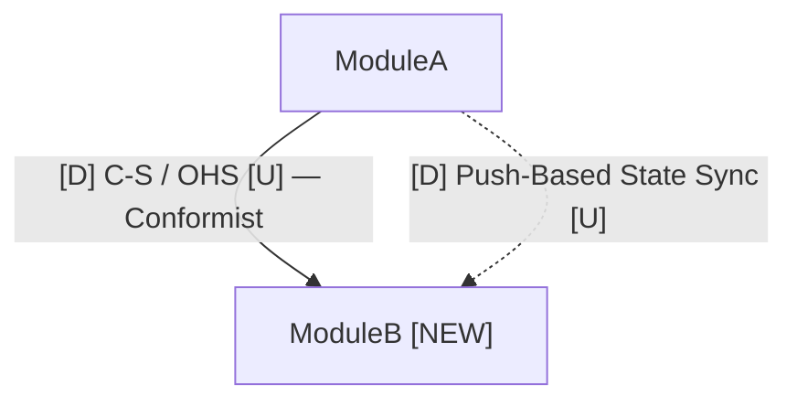

<!-- Archetype: RULES -->
<!-- Why RULES: prescribes integration pattern selection methodology, module boundary
     constraints, temporal coupling rules, and extraction-readiness design — all hard
     constraints on agent behavior. The pattern catalogue is inlined because the
     selection criteria are meaningless without it. -->

# Context Map — Integration Patterns

Use this file when domain discovery or option analysis identifies integration between two or more modules or bounded contexts. Apply it to select the right relationship type and communication style before proposing solution models.

Do not apply patterns by name. Use the selection criteria to derive which pattern fits. The name follows from the criteria, not the other way around.

---

## Strategic Patterns — Who Defines the Contract

These patterns describe the relationship between two contexts: who has authority over the shared interface, and how the downstream adapts.

---

### Shared Kernel

Two contexts share a common subset of the domain model. Both contexts own it jointly. Changes require explicit coordination between both.

**Use when:** Two contexts genuinely share the same core concept with the same lifecycle. The coordination cost is acceptable. Teams are co-located or tightly aligned.

**Avoid when:** The shared concept diverges in meaning between contexts. Teams move at different speeds. The coupling would force joint releases.

**Architecture:** Monolith, Modular Monolith, Microservices (shared library / shared package). In microservices, the shared library becomes a versioning and coordination burden — prefer Published Language instead.

**Risk:** Tight coupling. Any change to the shared model requires both contexts to adapt simultaneously.

---

### Partnership

Two contexts plan and evolve together. There is no upstream/downstream distinction — both succeed or fail together. Integration is co-designed.

**Use when:** Two teams build a tightly coupled feature together. Failure of one means failure of both. Change coordination is acceptable and expected.

**Architecture:** Monolith, Modular Monolith. In microservices, the coordination cost usually makes this untenable at scale — prefer explicit upstream/downstream relationships.

**Risk:** Tight coupling between teams and release cycles.

---

### Customer / Supplier

The upstream context (Supplier) defines the contract. The downstream context (Customer) uses it. The Supplier has an obligation to serve the Customer but retains control over its own model.

**Use when:** One module is the clear authority on a concept. Others consume its contract. The downstream's needs are known and relatively stable.

**Upstream signals:** Defines the interface. Sets the release cadence. Can break downstream if it doesn't honor the contract.

**Downstream signals:** Depends on the upstream. Negotiates requirements. Must adapt when upstream changes.

**Architecture:** All. In a monolith this is an in-process interface. In microservices it becomes a network-accessible API.

---

### Conformist

The downstream adopts the upstream model entirely with no translation. The upstream model leaks directly into the downstream.

**Use when:** The upstream model aligns well with the downstream's domain language. The upstream is stable. Translation cost is not justified. The downstream team accepts being shaped by upstream decisions.

**Architecture:** All.

**Risk:** Downstream is fully exposed to upstream model changes. If the upstream changes its model, the downstream must adapt across its entire codebase.

---

### Anti-Corruption Layer (ACL)

The downstream creates a translation layer that maps the upstream model into the downstream's own language. The upstream model does not leak into the downstream domain.

**Use when:** The upstream model is foreign, legacy, or poorly aligned with the downstream's domain language. The downstream must protect its own model from upstream drift. The upstream is unstable or changes frequently.

**Architecture:** All.

**Cost:** The translation layer must be maintained. It adds indirection. It is the right cost when the alternative is a corrupted downstream model.

---

### Open Host Service (OHS)

The upstream context defines a stable, explicit protocol designed for external consumption by multiple consumers. The protocol is versioned so that internal changes do not break downstream callers.

**Use when:** Multiple downstream contexts consume the same upstream module. The upstream must remain independently deployable and operable. Breaking changes to the interface are expensive. The interface must survive service extraction.

**Selection signal for OHS:** High fan-out (three or more consumers), or high autonomy requirement, or the module is expected to be extracted to a separate process.

**Architecture:** All. In a monolith, OHS is an in-process interface with a stable public surface. In microservices, it becomes an HTTP or gRPC API. The key property is that the interface is designed for external use, not for internal convenience.

---

### Published Language

A formalized, versioned, well-documented language used for integration between contexts. Multiple contexts can interpret it without the source module's internal model. Often combined with OHS.

**Use when:** Multiple bounded contexts exchange data and must be able to interpret it without coupling to each other's models. Events, message payloads, and query responses must be self-describing. Backward compatibility across versions is required.

**Architecture:** All, but critical in microservices and event-driven architectures where consumers are unknown at publish time.

---

### Separate Ways

No integration. Each context solves its own problem independently, even if it means duplicating a concept.

**Use when:** The integration cost exceeds the benefit. Each context can handle its own need without coupling. A shared concept would carry too much semantic baggage from the other context.

**Architecture:** Modular Monolith, Microservices. In a monolith this is uncommon — duplication is usually avoided.

---

### Big Ball of Mud

Acknowledged lack of clear boundaries. Every module knows about every other module. Not a design choice — a description of reality.

**When to flag:** The current system is a Big Ball of Mud when a change to module A requires reading module B's internals, or when there is no concept of a public contract between modules.

**Response:** Containment, not extension. Do not propose adding a new feature inside a Big Ball of Mud without first identifying a boundary to respect. Propose the boundary as part of the feature spec.

---

## Tactical Patterns — How Modules Communicate

These patterns describe the communication mechanism between contexts. Strategic pattern selection narrows the field; tactical pattern selection handles transport, timing, and reliability.

---

### Synchronous Request / Response

Caller sends a request and blocks until a response is received. In a monolith: direct method call via interface. In microservices: HTTP or gRPC.

**Use when:** A real-time answer is required before the caller can proceed. Temporal coupling is acceptable. Fail-closed behavior is correct (if the dependency is unavailable, the caller should fail, not continue on stale state).

**Avoid when:** The downstream effect does not need to happen before the caller continues. The callee is less reliable than the caller's availability requirement. Many callers are synchronously coupled to the same callee — creating a single point of failure.

**Architecture:** All (transport differs: in-process in monolith, network call in microservices).

**Temporal coupling:** Always present. The callee must be available at the time of the call.

---

### Event Publishing (Fire-and-Forget)

Publisher emits an event and does not wait for or expect a response. Consumers are unknown to the publisher.

**Use when:** The publisher's operation is complete regardless of what consumers do. The effect in consumers can happen after the fact. Publisher and consumers should evolve independently. Multiple consumers may react to the same event.

**Architecture:** Monolith/Modular Monolith: in-memory event bus. Microservices: message broker (Kafka, RabbitMQ, etc.).

**Temporal coupling:** None from the publisher's perspective. The consumer must process the event eventually but the publisher does not block.

---

### Event Subscription / Event-Driven

A module subscribes to events published by another module and reacts to them. The subscriber processes events asynchronously.

**Use when:** A module needs to maintain its own read model or state that reflects changes in another module. Loose coupling between producer and consumer is required. The subscriber can tolerate eventual consistency.

**Architecture:** All. In-memory in monolith, broker-based in microservices.

---

### Push-Based State Synchronization

A source module pushes state changes to a consumer's own store when those changes happen. The consumer never calls the source at query time — it queries its own copy of the relevant state.

**Use when:** A module must answer queries independently without calling other modules at query time. The module has high autonomy requirements (must be independently operable and extractable). Temporal coupling on the read path is not acceptable.

**Example:** Room active/inactive status is pushed to Availability when a room is created or deactivated. Availability enforces room status from its own room catalogue. It never calls RoomManagement at reservation-check time. If RoomManagement is temporarily unavailable, Availability can still answer availability queries correctly.

**Key property:** The consuming module owns the pushed state. The source module no longer needs to be available for the consumer to operate correctly.

**Architecture:** All. In a monolith, the push is a synchronous call at write time (CreateRoom → RegisterRoom in Availability). In microservices, the push may be an event delivered via broker.

**Contrast with Pull:** Pull-based aggregation (the consumer calls the source at query time) creates temporal coupling on the read path and prevents the consumer from operating independently. Do not use pull when the consuming module has high autonomy requirements.

---

### Block Registry (Exclusive-Access Registry)

A central module owns a registry of all active exclusive-access claims on a shared resource. All modules that want to claim a resource register through a single atomic gate. The registry enforces mutual exclusion — no two claims can overlap for the same resource at the same time.

**Use when:** Multiple independent modules can claim exclusive access to the same resource for a time period. Mutual exclusion across claim types must be enforced by one authority. The question "is this resource available?" must have exactly one truthful answer at any given moment.

**Key properties:**
- The registry is the single source of truth for claim state
- The registration call is the atomic gate — either succeeds or fails, never partial
- The registry must not query source modules at check time — it enforces from its own state
- Releasing a claim (cancel, complete) always goes through the registry

**Not suitable when:** claims come from a single source or when eventual consistency across sources is acceptable — a direct query is simpler and correct. Only use this pattern when multiple independent modules can create conflicting claims and mutual exclusion must be enforced atomically by one authority.

Do not use a federated query approach (where the registry queries each source module for its current claims at read time) when mutual exclusion across independent claim sources is required or when the registry must operate independently if source modules are temporarily unavailable.

**Architecture:** All. In a monolith, the registry is an in-process service. Designed correctly from the start (primitive types, idempotency, no outbound dependencies), it can be extracted to a separate service with no interface changes.

---

### Command / Query Messaging

Explicit, named commands or queries are sent to a specific module's handler. The sender does not wait for processing (async command) or receives a response (sync query). Messages are typed and versioned.

**Use when:** Operations should be explicitly named and traceable. The same operation may be dispatched from multiple callers. Decoupling callers from handler location is required (useful when a module may move or be extracted).

**Architecture:** Monolith/Modular Monolith: in-memory dispatcher (e.g., MediatR). Microservices: message broker or HTTP with typed request bodies.

---

### Saga / Process Manager

Coordinates a multi-step operation across multiple modules, where each step has a compensating action if a later step fails. Either orchestrated (one coordinator knows all steps) or choreographed (each module reacts to events and emits events for the next step).

**Use when:** A business operation must span multiple modules. Distributed transactions are not available or acceptable. Each step is independently fallible. Business rules define what to do on partial failure (compensation).

**Architecture:** Modular Monolith, Microservices. In a monolith with a shared database, a local DB transaction usually replaces the need for a saga — use a saga only when the monolith's transaction cannot span the required operations.

---

### Outbox Pattern

A module publishes an event or command by writing it to an outbox table in the same local database transaction as the domain write. A background processor delivers the outbox record to the broker or consumer. Guarantees at-least-once delivery even if the process crashes between the domain write and the publish call.

**Use when:** Reliable event delivery is required. Losing an event on process crash is not acceptable. A two-phase commit between the domain store and the broker is not available.

**Architecture:** Modular Monolith (optional), Microservices (standard pattern for reliable event publishing).

---

### Try-Reserve-Confirm (Two-Phase Block)

A claim on a resource is created as tentative (with a TTL). The caller persists its local aggregate and then confirms the claim. If confirmation never arrives (crash, timeout), the tentative claim expires and the resource is released automatically.

**Use when:** A block registration call and a local aggregate persist must succeed together, but a shared database transaction is not available. Orphan blocks must be prevented without an outbox. The TTL is short enough that temporary unavailability of the resource is acceptable.

**Architecture:** Microservices (most relevant when the registry is an external service). Can also be used in a modular monolith as a future-extraction preparation.

---

## Context Map Artifact Rules

Apply these rules when generating a `context-map.md` artifact, not only during option analysis.

### Run selection criteria for every relationship

Before labeling any arrow in the context map, run the selection criteria below for that relationship. Do not assign a pattern by name and stop — derive the pattern from the criteria.

### Pattern dimensions are not mutually exclusive

Strategic patterns (Customer-Supplier, OHS, Conformist, ACL) describe different dimensions:

- **Power relationship** (who controls the contract): Customer-Supplier, Partnership, Shared Kernel
- **Interface style** (how the upstream exposes itself): OHS (stable external protocol), Published Language (versioned self-describing payload)
- **Downstream adaptation** (how the downstream absorbs the upstream model): Conformist, ACL

A single relationship can carry labels from multiple dimensions. For example: Customer-Supplier / OHS (Conformist downstream) means "the upstream controls the contract, exposes it as a stable protocol for multiple consumers, and the downstream uses it without translation."

Do not collapse these into one label and omit the rest.

### Always label the downstream pattern

For every Customer-Supplier or OHS relationship, state whether the downstream is:
- **Conformist** — uses the upstream model as-is, no translation layer
- **ACL** — translates the upstream model into its own domain language

If uncertain, default to Conformist for in-process same-language integrations and ACL for external or divergent-model integrations.

### Separate arrows for different tactical patterns

If two modules communicate via two distinct tactical patterns (e.g., synchronous request/response for operational calls and push-based state sync for lifecycle events), use separate arrows — one per tactical pattern. Do not bundle them into one arrow with all method names listed.

---

## Context Map Diagram Format

The `context-map.md` artifact has three parts: a main diagram, an integration notes table, and optionally an interaction details section.

### Legend — always include

Every `context-map.md` must include a `## Legend` section before the main diagram. Include only the abbreviations that appear in the document.

Minimum entries when using the standard format:

| Abbreviation | Meaning |
|---|---|
| U | Upstream — defines and owns the contract |
| D | Downstream — depends on and conforms to the upstream contract |
| C-S | Customer-Supplier — upstream controls the contract, downstream adapts |
| OHS | Open Host Service — stable protocol designed for multiple consumers |
| ACL | Anti-Corruption Layer — downstream translates upstream model into its own language |
| Conformist | Downstream uses the upstream model as-is |
| PL | Published Language — versioned, self-describing message format |

Add or remove rows to match what is actually used in the document. Do not include abbreviations that do not appear.

---

### Main diagram — what to show

The main diagram shows **module names and strategic relationships only**. It must not contain method names, interface names, implementation details, or module responsibility descriptions.

**Node labels:** module name only. Use `ModuleName ["ModuleName [NEW]"]` or `ModuleName ["ModuleName [EXTENDED]"]` to mark modules affected by the feature. No other text inside the node.

Do not use Markdown bold (`**name**`) inside Mermaid node labels — it renders as literal asterisks. Use plain text only.

**Arrow labels:** `[D] PatternLabel [U] — DownstreamAdaptation` on a single line. Keep it short.

Use a dashed arrow (`-.->`) for Push-Based State Sync or Event Publishing. Use a solid arrow (`-->`) for synchronous request/response.



Add a one-line legend below the diagram when both arrow types appear:
```
Solid arrow — synchronous request/response.
Dashed arrow — push-based state sync or event publishing.
```

**Module responsibilities table:** immediately after the legend, add a table listing each module and its single-line responsibility description. This is where descriptions live — not inside diagram nodes.

| Module | Responsibility |
|---|---|
| ModuleA | Brief responsibility description |
| ModuleB [NEW] | Brief responsibility description |

### Integration Notes table — what to show

Below the main diagram, include a table with one row per relationship:

| Relationship | Strategic Pattern | Downstream | Tactical Pattern | Interface |
|---|---|---|---|---|
| ModuleA → ModuleB | Customer-Supplier / OHS | Conformist | Synchronous request/response | `IContractName` |

Include the **interface name** but not method signatures. Method signatures belong in the Interaction Details section or in `implementation-plan.md`.

### Integration Flows — when to add

Add an `## Integration Flows` section when the feature introduces new cross-module contracts or changes how modules communicate. This section replaces a single combined sequence diagram.

**Format rules:**
- One sequence diagram per **business use case**, not per module or per interface
- Each diagram starts from the **primary actor** for that use case — not from a module. Use the actor who initiates the business intent: a Guest initiates a reservation, Hotel Staff initiates room or maintenance operations. If a secondary actor can trigger the same flow (e.g., staff-assisted booking), add a one-line note below the diagram rather than duplicating it.
- Each diagram covers exactly one business operation from actor trigger to actor response
- Group use cases under module headings (e.g., `### Room Management`, `### Reservations`, `### Maintenance`)
- Show the full interaction chain: actor → calling module → Availability → result back to actor
- Show `alt` / `else` blocks when the interaction has a meaningful success/failure branch
- Add a short prose note below a diagram only when a non-obvious constraint is not visible in the diagram itself (e.g., side-effects, ordering guarantees)

**Arrow labels:** use the business action or event name only. Do not include method names, parameter lists, or call sequences. Method signatures belong in `implementation-plan.md`.
Good: `"Reserve room for period"`, `"Release block"`, `"Check authorization"`.
Avoid: `"TryRegisterBlock(roomId, period, blockId, Reservation)"`, `"ReservationAuthorizationService.CanManage(actorAccountId, reservation)"`.

**Branching paths:** prefer `alt/else` blocks over `Note right of X:` for conditions. Notes containing special characters (`->`, `==`, Unicode arrows) are fragile across renderers. Use the `alt` label to describe the condition.

**Self-calls:** avoid `X->>X:` for internal logic. Internal state transitions and authorization checks are implementation details. If they must appear, describe them in prose below the diagram, not as arrows.

**Multiple actor paths to the same outcome:** use one diagram with an `alt` block rather than separate diagrams that duplicate boilerplate.

Do not add integration flows for local changes (single module, no cross-module contracts).

Do not put all operations into one combined diagram. One diagram per use case.

**Naming the section:** The file title should reflect both the strategic and tactical views it contains. Use "Module Map & Integration Flows" as the document title when integration flows are included.

---

## Selection Criteria

Before labeling a relationship in the context map or before recommending an integration pattern, answer these questions in order.

### 1. Fan-out: how many modules consume this contract?

- One consumer → Customer/Supplier, possibly Conformist
- Two or three consumers → OHS
- Four or more consumers → OHS with Published Language (versioning and backward compatibility become mandatory)

### 2. Autonomy: which module must operate independently?

The module with the highest autonomy requirement (most critical, most performance-sensitive, most likely to be extracted) should:
- Minimize its **outbound** synchronous dependencies
- Expose itself as OHS so others call into it, not the reverse
- Own all state it needs to answer queries (push-based synchronization for dependencies)

A module with high autonomy must not depend on other modules at query time. Every outbound synchronous call on a hot read path is a runtime dependency that will break the module's autonomy when it is extracted.

### 3. Stability: which side changes more frequently?

- Upstream changes frequently → downstream needs ACL to protect its model from upstream drift
- Upstream is stable → Conformist is simpler and sufficient
- Both change frequently → Partnership or explicit versioning (Published Language)

### 4. Change propagation: who absorbs the cost of change?

Ask: when Module A's model changes, which modules need to adapt?
- Many modules → Module A should expose OHS and version carefully; do not let the change cascade
- One module → ACL in the downstream module is the right cost allocation

### 5. Domain model alignment

Do both modules use the same language for this concept?
- Yes → Conformist is simpler
- No → ACL is needed to protect domain language integrity

### 6. Temporal coupling acceptability

Does the downstream operation require a real-time answer from the upstream?
- Yes, and fail-closed is correct → synchronous request/response is acceptable
- No, or the upstream is less stable → prefer event publishing or push-based synchronization

---

## Module Boundary Rule

**A module that defines a public contract must implement that contract itself.**

The only valid "external implementation" of a module's own contract is when the in-process implementation is replaced by a remote call upon module extraction. No other module should implement a module's own interface and inject that implementation back into the defining module.

**Allowed:**

```
Module A defines IModuleAService
Module A implements ModuleAService internally
Modules B, C call IModuleAService → one-way dependency: B → A, C → A
At extraction: B and C replace in-process call with HTTP/gRPC client
Dependency direction does not change; only the transport changes
```

**Not allowed:**

```
Module A defines IModuleAProvider
Module B implements IModuleAProvider → B depends on A's interface
Module B's implementation is injected into A → A depends on B at runtime
Module B also calls IModuleAService → B also depends on A's service

Result: A ↔ B bidirectional coupling at runtime
        Circular HTTP at the service boundary if extracted
        Multiple sources of truth if B owns state independently
```

Messaging-based architectures (event publishing, command dispatching) follow different rules depending on the repository's approach — apply this constraint specifically to synchronous interface injection, not to event subscriber registration.

---

## Temporal Coupling Assessment

Temporal coupling exists when Module A's operation requires Module B to be available at the same moment.

**Acceptable temporal coupling:**
- The operation requires a real-time answer before the caller can proceed (availability check before reservation)
- The dependency is on a module with equal or higher availability and stability guarantees
- Fail-closed behavior is correct: if the dependency is unavailable, the caller should fail, not continue on stale state

**Problematic temporal coupling:**
- The downstream effect does not need to happen before the caller continues
- The callee has lower availability than the caller's SLA requires
- Many callers are synchronously coupled to the same callee, creating a single point of failure on the read path

**Eliminating temporal coupling on the read path:**
Use push-based state synchronization: source modules push state changes to the consumer's own store when changes happen. The consumer reads its own store at query time and never calls the source. The source's availability does not affect the consumer's ability to answer queries.

---

## Extraction-Readiness Design

When a new module is introduced with potential for future extraction to a separate process, apply these rules during the initial monolith implementation. The cost of each rule is near zero in the monolith. Skipping any of them makes extraction significantly more expensive later.

### 1. Separate schema from day one

The module's persistence layer must be private. No other module's code may JOIN against its tables. No other module may own a foreign key into its tables. Other modules query the module's data only through its public interface.

If the schema is shared at implementation time, separating it before extraction becomes a migration project that blocks the extraction entirely.

### 2. Primitive types in the public interface contract

Method parameters and return types in the module's public interface must use primitive types: `Guid`, `string`, `DateTimeOffset`, numeric types, and simple result wrappers. Do not use internal value objects, enums, or domain types from other modules.

When the in-process implementation is replaced by an HTTP or gRPC client, the contract must map cleanly to the wire format without transformation.

### 3. Idempotent write operations

All write operations on the module's public interface must be idempotent: calling the same operation twice with the same inputs produces the same result and does not create duplicate state.

In the monolith, the DB transaction ensures each call happens exactly once — idempotency guards are never triggered. After extraction, network retries after a timeout mean the caller does not know whether the first call succeeded. The retry must be safe.

Design rule: if called twice with the same ID and identical parameters, return success. If called on an already-released or unknown ID, treat as a no-op success.

### 4. Compensation call structure written now, activated at extraction

Each handler that calls the module's write operation followed by local persistence should be written with an explicit compensation step:

```
// Step 1: call module
var result = await moduleService.RegisterSomething(id, ...);
if (result.IsFailure) return result.Error;

// Step 2: persist local aggregate
var persistResult = await repository.Add(aggregate);
if (persistResult.IsFailure)
{
    // Compensation: undo the module call
    // In monolith: DB transaction rollback makes this a no-op.
    // After extraction: this call becomes load-bearing.
    await moduleService.ReleaseSomething(id);
    return persistResult.Error;
}
```

In the monolith, the transaction rollback means the compensation call never executes. The code structure is ready for extraction without modification.

### 5. No outbound module dependencies

The module must not call other modules at query time. All state the module needs to answer queries must be in its own store, populated by push-based state synchronization from source modules at write time.

A module with outbound dependencies at query time cannot be extracted without creating new synchronous network calls on the read path, which reintroduce temporal coupling at the service level.

---

### Two-phase commit patterns at extraction

When the module is extracted, the single DB transaction no longer spans both the module's write and the caller's local persistence. Three patterns address this:

**Synchronous compensation (saga step):** If local persistence fails, immediately call the module's release/undo operation. Retry with backoff if the call fails. Works when the compensation call is idempotent (it is, by rule 3). Limitation: process crash between failure and compensation leaves an orphan record until a cleanup job runs.

**Outbox pattern:** Persist the local aggregate + an outbox record (pending module call intent) in a single local DB transaction. The aggregate starts in a "pending" state. An outbox processor delivers the module call asynchronously. The module confirms. Aggregate transitions to "active." Eliminates the orphan problem entirely. More complex to implement.

**Try-Reserve-Confirm:** The module creates a tentative claim with a TTL. The caller persists the aggregate and confirms the claim. If confirmation never arrives, the TTL expires and the claim is released automatically. Eliminates orphans without an outbox. Adds a second round-trip and TTL management.
